---
layout : post 
title : Sharky CTF 2020 
--- 

# Mở đầu  
Cuối tuần này team Nupakachi có chơi giải Sharyky CTF 2020. Mình đánh giá đề cũng khá hay và ở mức độ trung bình. Rảnh rỗi lại ngồi viết writeup về một số bài mình làm được trong cuộc thi.  

# Table of Content  

 + **[Crypto](#crypto)**  
   + [Noisy RSA](#noisy_rsa)  
   + [Heavy Computation](#heavy_computation)  
   + [Casino](#casino)  

 + **[Reverse](#reverse)**  
   + [Secure db](#securedb)  
   + [Miss Direction](#missdirection)  

 + **[Pwn](#pwn)** 
   + [Captain hook](#captain)


<a name="crypto"></a>
# Crypto   
Crypto có 3 bài liên quan đến toán :v Cũng khá là hay và thú vị. Không quá khó. (*￣3￣)╭   

<a name="noisy_rsa"></a> 
## Noisy RSA   

Theo rule thông thường, public key sẽ không thể break. Chúng ta được cho `e`, `N`. Và đoạn mã hóa :   

```python
rand = bytes_to_long(get_random_bytes(64))

ct = []
ct.append(encrypt(rand << 24))
flag = b"shk"
for car in flag:
	ct.append(noisy_encrypt(car,rand))
``` 

Hàm `noisy_encrypt` là một hàm mã hóa RSA thông thường.  
Như vậy, mỗi kí tự của flag được kết hợp với giá trị `rand` kia. Có được rand là ta có thể break được mã hóa này.  

```python
def noisy_encrypt(a,m):
	return encrypt(pow(a,3,N)+(m << 24))
``` 

Ta sẽ quy mã hóa trên thành một bài toán đơn giản.  


```
Cho 2 số a, b đã biết. Tìm x ?  
```
Do flag có dạng `shkCTF` nên ta hoàn toàn biết được a, b và đưa về bài toán trên.  

Do x < N nên việc cần làm bây giờ chỉ là triệt tiêu bậc mũ của x bằng các phép biến đổi tương đương.  

Đầu tiên triệt tiêu bậc 3 bằng cách lấy phương trình (3), (2) trừ đi phương trình (1).  

  

Sau đó, tiếp tục triệt tiêu bậc bằng cách nhân phương trình (4) với b, phương trình (5) với b rồi trừ cho nhau. Ta thu được :  

  

Giải phương trình bậc nhất trên ta thu được x cần tìm. Sau đó đơn giản là bruteforce từng kí tự để recovery flag thôi.  


<a name="heavy_computation"></a>  
## Heavy Computation  

Bài này chúng ta cần optimize đoạn code :  

```python
for i in range(NB_ITERATIONS):
    start = start ** e
    start %= N

#We are never too cautious let's make it harder

key = 1
for i in range(NB_ITERATIONS):
    key = key ** e
    key %= N
    key *= start
    key %= N
```  

Trước hết cần tìm phi N bằng sage 😂 Sage có cái built in để tính phi nên dùng nó cho tiện.  
Sau đó, đơn giản là làm chút toán học dựa trên phi N thôi.  

Solution :  

```python
def compute1(password) : 
    start = bytes_to_long(password.encode())
    e0 = pow(e, NB_ITERATIONS, phi)
    return pow(start, e0, N)


def compute2(start) : 
    e1 = (pow(e, NB_ITERATIONS, phi) - 1) * inverse(e-1, phi)
    return pow(start, e1, N)
``` 

## Casino  
Bài này khá ít người làm được. 😂 Không hiểu sao.  

Bài này cho 1 file apk. Đáp vào `jadx` để decompile thì ta thấy nó có hàm random trong java.  
Nhiệm vụ của chúng ta là nó cho trước 2 số được sinh ra bằng hàm random trong java. Chúng ta cần tính tích của hai số đó. Đúng thì nó sẽ cho chúng ta flag.  

Lên mạng search một tí về cách break hàm random trong java thì ra ngay solution. 🤣🤣🤣 Life is ez.  

Hàm java random còn dễ break hơn hàm random trong python. Chỉ cần 2 số là ta có thể đoán được số tiếp theo.  


<a name="reverse"></a>
# Reverse  

<a name="securedb"></a> 
## Secure DB  
Đây là 1 bài crackme file ELF 32 bit.  

File binary bị áp dụng kĩ thuật `anti disassemble` nên ta không thể dùng F5 để đọc source code.  

  

Tại sao lại có thể anti disassemble?  
Vì một câu lệnh nó nhảy ngược lại tói 1 đoạn code gây khó hiểu. Điều kiện nhảy luôn luôn xảy ra :  

```
xor eax, eax
jz ...
```  
Như vậy, ta tiến hành `NOP` vào 2 bytes tại địa chỉ `80487B2`. Tức là nó sẽ thực hiện các lệnh sau lệnh jmp luôn. Do đó code sẽ không bị reuse.  

Sau khi vượt qua tất cả các đoạn `anti disassemble`, chúng ta có thể nhấn `P` để define lại hàm `main` và nhấn `F5`.  

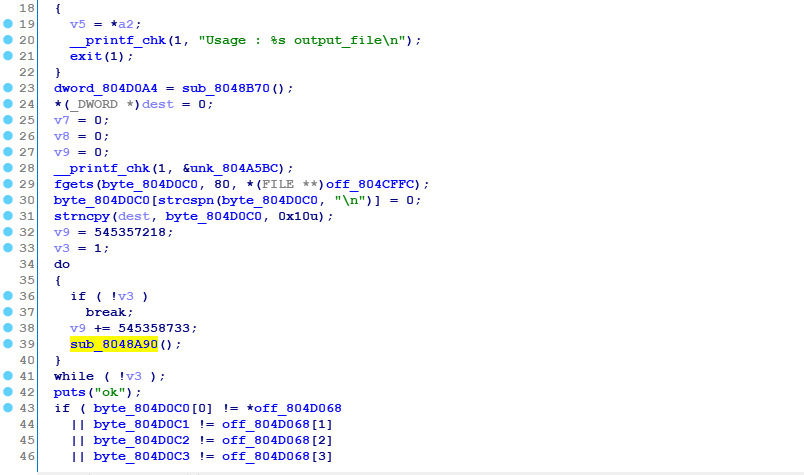

Chương trình nhận đầu vào là tên file output. File này khi điền đúng key ta sẽ tải về được 1 file `sqlite` chứa flag để đọc.  

Input được nhập vào tại `byte_804D0C0` và được biến đổi bằng hàm `sub_8048A90`.  

  

Hàm này gọi thực thi shellcode bằng lệnh `call $+5`.  

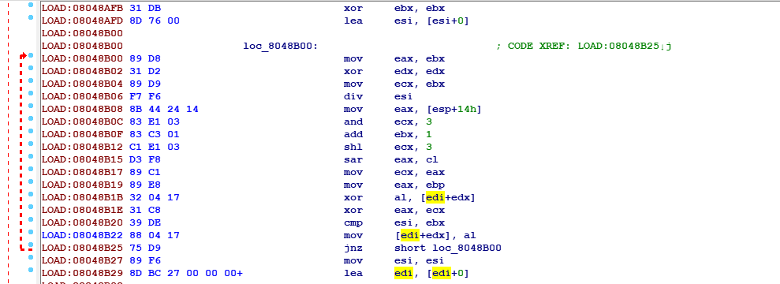  

Bằng debug, ta thấy input được mã hóa bằng thuật toán xor và được lưu trở lại input :  

```
xor     al, [edi+edx]
xor     eax, ecx
cmp     esi, ebx
mov     [edi+edx], al
```  

Đặt break point tại đoạn xor để xem nó xor với cái gì. Bằng debug, nhập các input khác nhau thì ta thấy nó xor với cùng 1 key có độ dài 4.  
Nếu bằng thuật toán xor, chúng ta chỉ cần cho đầu vào là `target` cần đạt được đồng thời đặt breakpoint tại đoạn so sánh thì ta sẽ thu được key cần tìm. 😋😋😋  

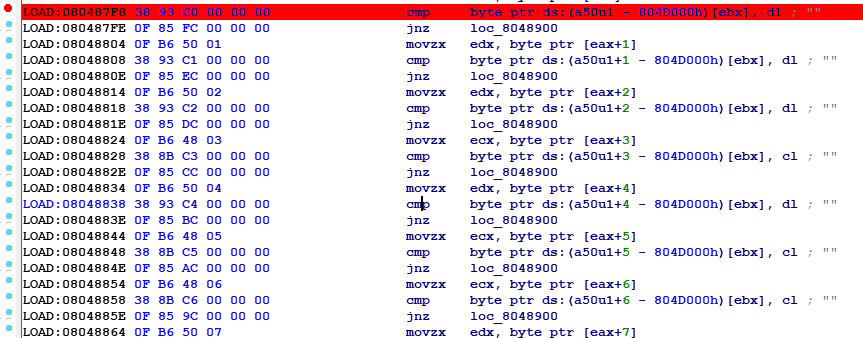  

Lạ một chỗ là làm với file đã patch các kĩ thuật anti disassemble thì nó ra kết quả sai. Chắc mình đã bỏ lỡ gì đó. 😐 Tuy nhiên thuật toán vẫn là xor . Vẫn đặt breakpoint như trên.   

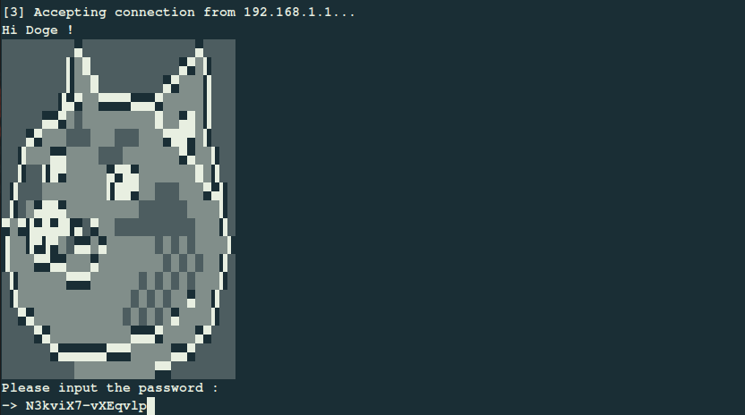  

Và có key :   

  

Điền đúng key thu được file sqlite. Mở bằng tool online nào đó rồi đọc flag từ database thôi 😁😁😁  


<a name="missdirection"></a> 

## Miss direction  

Lại là một bài crackme trên ELF 32 bit.  

Hàm main :  

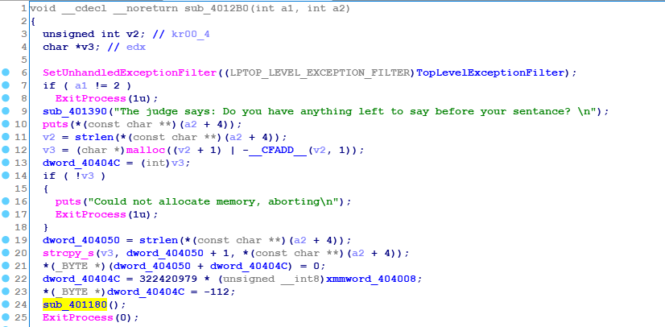  

Hàm check key :  

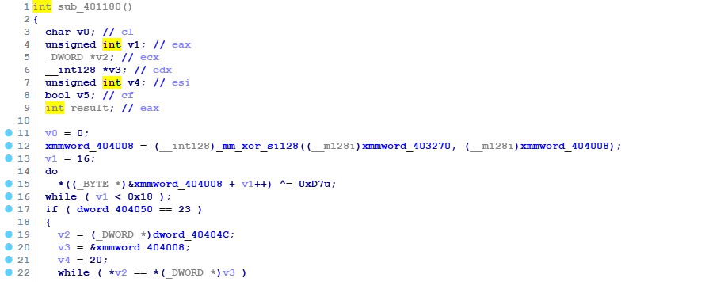  

Nếu đúng sẽ in ra flag :  

  

THuật toán check chỉ là thuật toán xor. Vì vậy thực hiện xor ngược lại thì kết quả là một đoạn text troll 😑😑😑  

Có vẻ như có gì đó xảy ra trước khi chương trình được thực hiện. Bài này là một bài liên quan tới anti debug.  

`TlsCallback_0` là một hàm luôn luôn được thực hiện trước hàm main. Vì vậy, hàm này có thể làm thay đổi dữ liệu, thay đổi flag các kiểu. Do đó cần phân tích nó 🙄  

Đầu tiên, hàm này thực thi một hàm :  

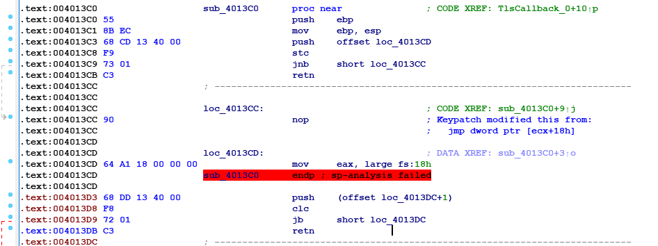  

Hàm này đọc từ fs:18h. Nó là `PEB` hay gì đó 😂 không nhớ lắm. Nên nó là 1 cái anti debug. `Nop` nó ≡(▔﹏▔)≡   

`Nop` hết đoạn đầu cho rằng nó là debug :)).Tiếp đến, nó thực thi một hàm đáng nghi 🙂 Patch đoạn debug thế nào cũng phải cho nó vào thực thi hàm này thì mới được.  


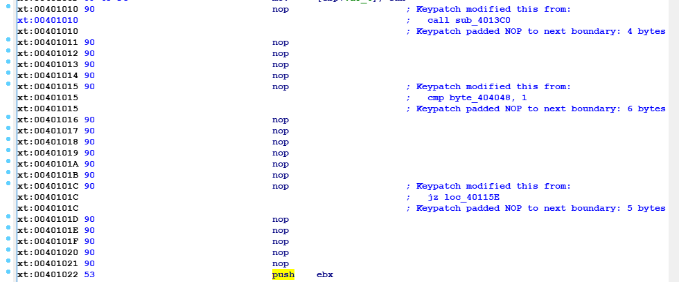  

Hàm này lại thực thi một hàm :  

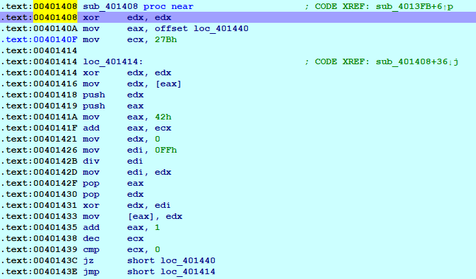  

Hàm này thực hiện decode gì đó tại hàm `401440`. Hàm này là hàm ẩn. Thuật toán decode thì không cần care. Chỉ cần đặt breapoint tại hàm `sub_401440` là được.  

Lệnh đầu tiên của hàm này hơi fake. Cho nên chúng ta dùng lệnh `C` để define các lệnh còn lại.  

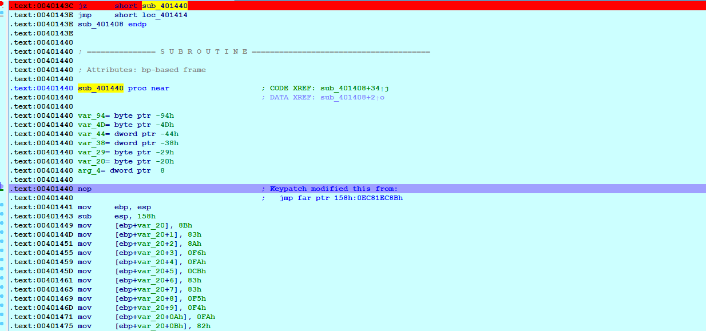  

Dùng lệnh `P` đề define hàm rồi `F5`. Ta thu được một hàm check tương tự như hàm `main`.  

Đây là target :   

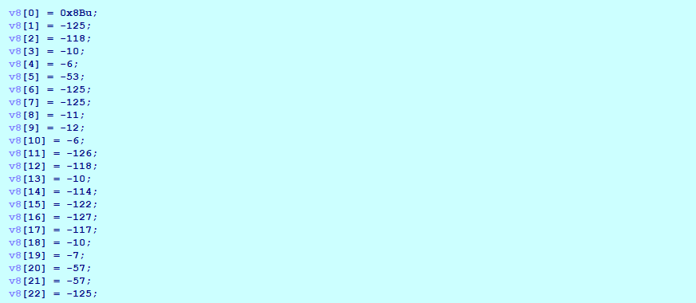

Đây là đoạn mã hóa :   

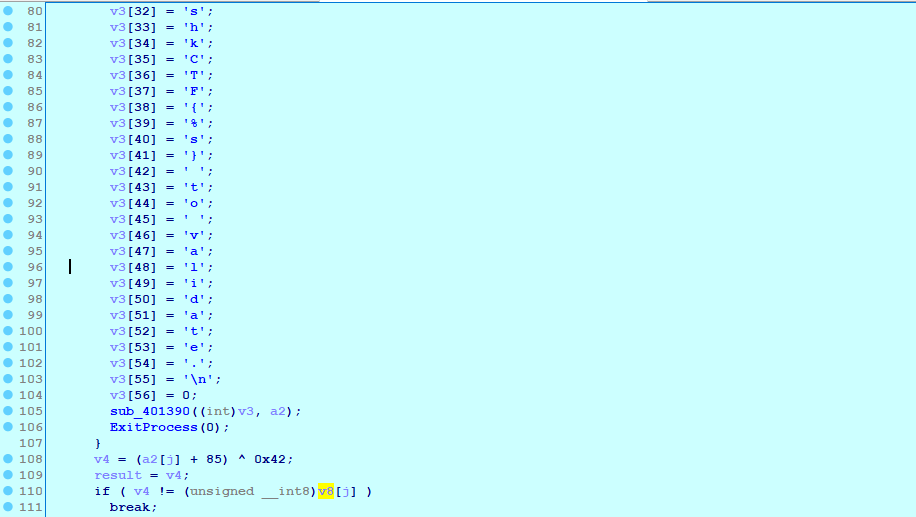  

Dịch ngược giờ là khá dễ dàng. 😁😁😁  


<a name="pwn"></a>  

# PWN  

Các bài khác rất basic còn bài còn lại reverse code khá dài nên mình không làm 😅😅😅 Viết ở đây bài `Captain hook` thôi.   

<a name="captain"></a>  

## Captain hook  

Nghe tên `hook` chắc tác giả định dùng cách ghi đè lên `malloc_hook` hoặc `free_hook` gì đó. Nhưng không cần. Với lỗi format string thì chúng ta chả cần động gì tới heap cả. 😂  

`Nghe thì rất heap nhưng lại là format string`.  

Chương trình có các chức năng như sau :  

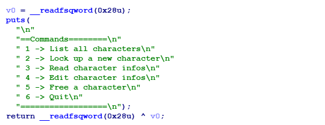   

Các node được thiết kế theo struct :   

```c
struct node {
    int age; 
    char [32] name; 
    char [32] date; 
} 
``` 

Chúng ta có một lỗi format string nằm ở hàm `read_character_infos`.  

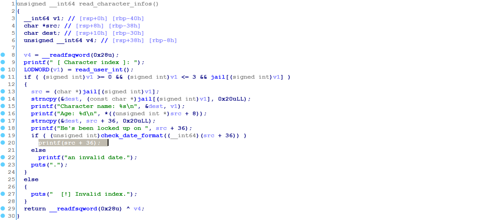   

Tuy nhiên, nó bị fitler bởi hàm `check_date_format`.  

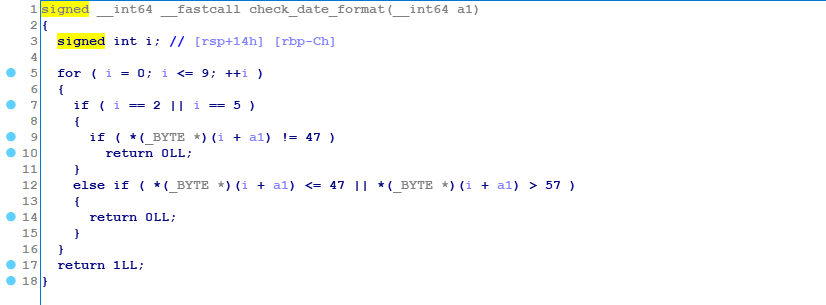  

Nó check 10 kí tự đầu sao cho phải thỏa mãn định dạng : `DD/MM/YYYY`.  
Vì vậy, không thể dùng trực tiếp lỗi format string này được.  

Lỗi tiếp theo nằm ở hàm `edit_character`.  

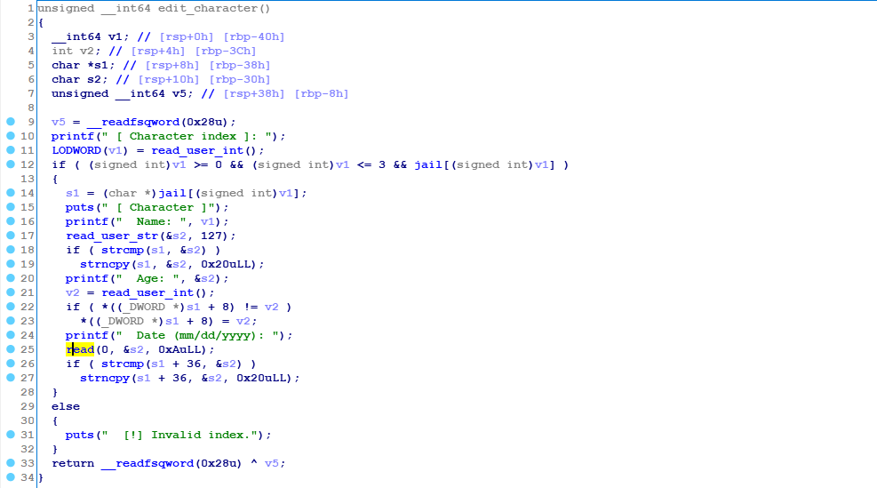  

Chúng ta có thể sửa `name`, `age`, `date`. Điểm đáng chú ý ở đây là khi sửa `name` và `date` đều dùng chung 1 biến nội bộ `s2`, hàm đọc vào là hàm `read`. Vậy nên nó sẽ không bị `null` terminate. Tiếp đến, hàm `strncpy` update `date` lại copy 0x20 bytes từ biến này. Vì vậy, ta có thể edit `name = 'a' * 0xa + '%x'` sẽ được lỗi format string.  

Với lỗi format string này, chúng ta có thể leak địa chỉ của stack -> return address của main.  

Dùng lỗi này để ghi đè lên địa chỉ trở về thành `one_gadget`.  

Có khó khăn tí là buffer khá là nhỏ. Có 22 bytes để thực hiện ghi. Nên ta chỉ có thể ghi từng bytes một với `$hhn`.  


